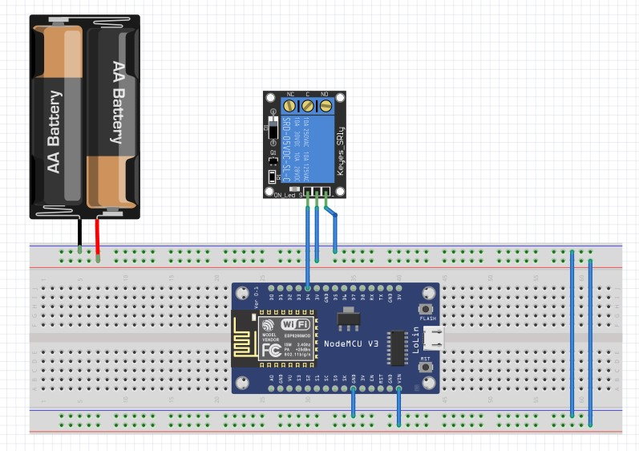

# Controla tu casa usando un Bot de Telegram
En el siguiente repositor se presenta el código fuente para control de luces usando un chatbot de Telegram y una placa MCU ESP32 o ESP8266.

# Explicación en video:
https://youtu.be/PpsqJBTnZ_4

# Elementos requeridos:
- 1x ESP8266 (NodeMCU) o ESP32
- 1x Placa de Rele x1 rele
- 1x fuente switching 5v

# Pasos previos:
Para poder conectar con Telegram, deberemos tener la librería <UniversalTelegramBot.h> instalada en nuestro entorno, para ello solo haremos clic en el menú "Programa" del Arduino IDE y luego "Incluir Librería" para por último seleccionar "Incluir Biblioteca .ZIP". Hecho esto nos dará a seleccionar un archivo en nuestra PC el cual será el .ZIP de nombre "Universal-Arduino-Telegram-Bot-master.zip" incluido en este repositorio.

# Como crear un Bot en telegram:
Para obtener un API Token y un Chat ID en Telegram deberemos abrir nuestro cliente Telegram tanto sea en nuestro móvil o en nuestra PC y buscaremos entre nuestros contactos al contacto BotFather.
Una vez que lo seleccionemos como para iniciar una charla se nos abrirá una ventana pero en lugar de un campo de texto para escribir aparecerá un botón "INICIAR", al cual le haremos clic. Esto nos iniciara una instancia con BotFather el cual nos tirara una lista de comandos disponibles para crear o administrar nuestro bot. 

De dicha lista deberemos hacer clic o bien escribir el comando "/newbot". 

A continuación, nos solicitara que escribamos un nombre para el nuevo bot y de estar el nombre disponible nos dirá que le asignemos un nombre publico terminado con '_bot' ejemplo: DEMO100_bot

Si todo salió bien BotFather nos enviara un mensaje indicando cual es el nombre del bot y cuál es nuestro API Token. Haremos clic en el link del chat, y apretaremos el botón iniciar. 

Ya tenemos nuestro API Token por lo que falta obtener el ChatID, para ello iremos a la página:

- https://api.telegram.org/bot000000:000000000000/getUpdates 

en donde 000000:000000000000 es el API Token. 

De estar todo OK nos abrirá un texto en formato JSON con un código 200 y la palabra OK.

Ahora vamos al chat de Telegram en donde esta nuestro bot y escribiremos cualquier cosa, no importa el contenido del mensaje, es solo para actualizar el estatus del chat, hecho esto volveremos a la página antes abierta y daremos refrescar para ver que el JSON ahora es diferente, contiene más información, entre ella una clave llamada "ID": NUMERO DEL CHAT ID, siendo ese número el que deberemos incluir en el fuente a cargar en nuestra ESP8266 o ESP32.

